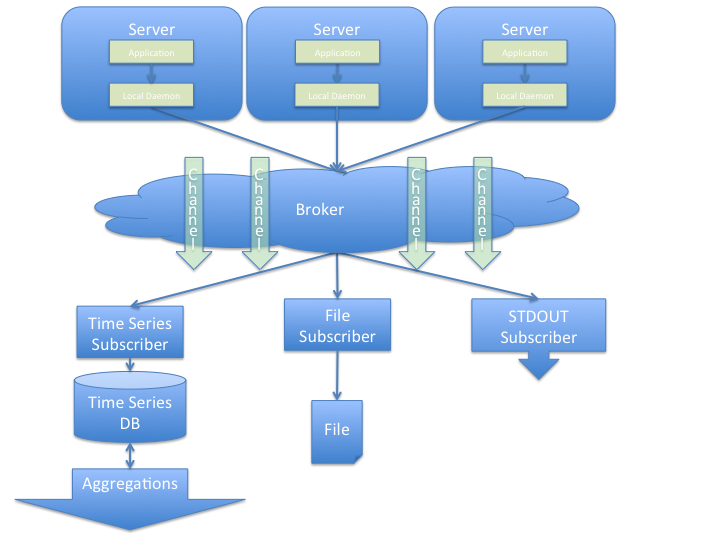
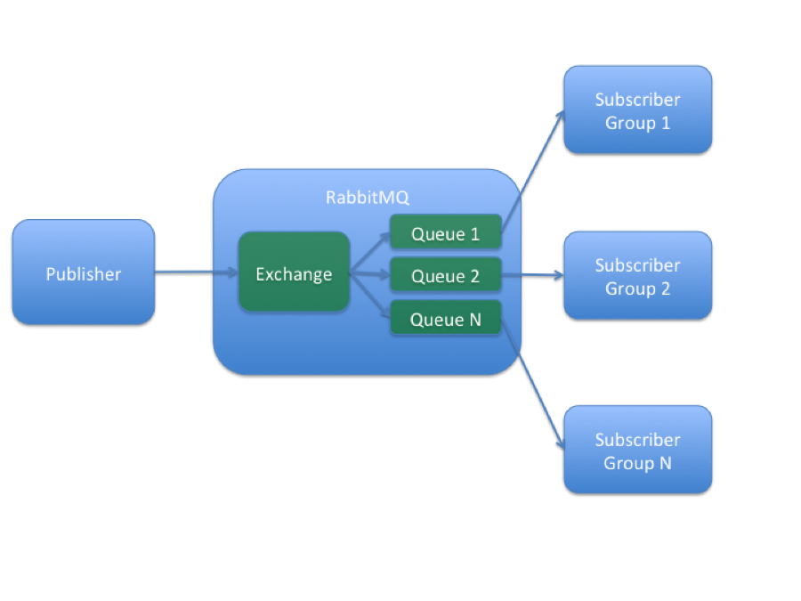

# PayPal Metrics System

# Overview
Metrics are an important tool for monitoring, planning and sometimes debugging
live server environments. This document outlines a flexible system for accepting
 and recording metrics from many different live running processes.

We’ll discuss the three major components of the system:

- The client software used to publish metrics
- The subscriber software used to receive and store metrics
-	The mechanism to move metrics from client to subscriber

# Requirements
1. Provide a centralized system to accept, publish and record published metrics
  - The system must allow for publishing millions of records per second without
  impacting the publishing or recording software, or the backend reporting
  systems.
  - The system must determine where to record the metric based only on metric
  data sent.
2. Provide clients to publish metrics in at least the following languages:
  - Go (?)
  - Java
  - Scala
3. Publish and report at least the following data types (taken from the
StatsD specification at https://github.com/b/statsd_spec):
  - Gauges
    - An instantaneous value calculated on the client
    - Example: killing a thread
  -	Counters
    - A value to be incremented or decremented
    - Example: number of requests received
  - Timers
    - Elapsed time for an operation to complete
    - Example: elapsed time for a network request to return
  - Meters
    - The rate of events that occur over time
    - Example: requests per second to a web server
    - Similar to counters, but are aggregated on the server differently as a
    rate of counts over time

# Architecture
This system’s architecture focuses primarily on performance and safety of the
publishing code.
We will allow gaps in or loss of metric data in extreme cases to maintain the
health of publishing systems, which are critical to the business. Figure 1
shows a high level architectural view.


Figure 1: High level architecture of this system

# Centralized System
We are using a centralized system to tightly control the backend metrics
infrastructure. Additionally, we will aim to very loosely couple the publishing
application and the rest of the infrastructure, so we can scale out the number
of publishers independently from the rest of the system.

Applications will publish metrics to a broker. Subscribers will listen on that
broker for published metrics and record them to the appropriate system.
Subscribers may also do simple data aggregation.

Application and subscriber will communicate using a well-known data format,
serialization system, and transport mechanism.
Millions of Metrics per Second
Given the large amount of data we intend to publish, we primarily need to
protect the CPU and I/O resources of the application and application server.
We also need to protect the network resources between the application and our
system as well as the CPU workload that our system will incur under load.

This section discusses the features we’ll put in place to ensure that
applications can publish freely and safely while we protect the rest of our
system.

## Publisher Features
The publisher is made up of two components: the application and the local
daemon.

The application sends all recorded metrics over UDP on the loopback interface
to the local daemon. All UDP sends are done asynchronously and out of the
critical path. Each application will make the asynchronous calls differently
depending on its environment, and we will make various client libraries
available for application developers to use.

The local daemon rate limits and samples metrics it receives. It then batches
metrics and sends them over the network to the appropriate downstream broker
or service (see below).

Additionally, the daemon has a kill switch command, which we’ll use in case
there are performance concerns.

## The Local Daemon
We will build the local daemon in order to keep complex logic out of application
code. By doing so, we also have fine-grained control over publishing behavior
that we can change without requiring modifications to application code, which
is controlled by other teams, written in many different programming
environments, and deployed to many different locations.

Additionally, application logic sends metrics over UDP to the daemon, which
inherently protects that logic from daemon outages (such as when we deploy new
daemon code), bugs or other problems.

Following are goals and non-goals of the local daemon:
1. Send all metrics to the broker as-is. Avoid doing data aggregation.
2. Send sampled metrics to an (limited size) in-memory buffer, and flush the
buffer in the background to the downstream broker.
  - If the daemon can’t flush the buffer to the broker fast enough it will
  drop new messages until cleared. In this case, the daemon will keep track
  of how many messages it had to drop, for debugging purposes.
3. Back-off when network sends to RabbitMQ have high latencies. The daemon
may also need to drop incoming messages in this case. Again, the daemon will
have to track how many messages it had to drop in this case for debugging
purposes.
4. Daemons will read various configuration data from an external configuration
system, which is independent from this project and out of scope of this
specification. Below is a non-exhaustive list of the values the client will
read:
  - Over the wire batch size
  - Sampling rate
  - Buffer size cap
  - Emergency kill switch

## Subscriber Features
Subscribers will have logic to protect their own resources as well as the
systems to which they record metrics. Initially, they will rate limit the total
number of metrics they’ll accept per time window as well as the number of
metrics per publisher per time window.

The former limit is intended to protect from overload due to high concurrency
of many well-behaved publishers, and the latter to protect from overload due
to one or more poorly behaved publishers. We expect local daemon size limits
to prevent this situation in practice.

We may build a feedback mechanism, which subscribers will use to communicate
configuration changes to local daemons. Such a mechanism is not a requirement
for v1 and is out of scope of this document.

## The Broker
Local daemons will publish batches of metrics to a message broker. The broker
will forward each batch to subscribers. We require the following features from
the broker:

1. Routing: A local daemon can publish metrics to a channel, which is a unique
identifier inside one broker system. Processes who subscribe receive all
subsequently published messages on that channel.
2. Multiplexing
  - Many subscribers can subscribe to the same channel.
  - A subscriber can subscribe to multiple channels at once.
3. Subscriber Groups
  - For increased throughput and redundancy, multiple subscriber instances can
  act as a single, large subscriber. The purpose of groups is to achieve high
  availability and failover subscription to a channel.
4. Exclusivity And Retry
  - Within a subscriber group, only one subscriber instance will complete one
  message.
  - If multiple subscriber groups subscribe to a channel, the previous
  requirement applies within each group.
  - A message will be delivered to the next subscriber instance within the
  group if the previous didn’t complete processing.
5. Horizontal Scalability and Redundancy: We can add more nodes to the broker
system to increase its throughput and reliability.
6.	Low Latency: Publishing from app code should be a fast operation in all
cases, and not affected by the state of operation of any other component. That
is, publishing should be O(1) with respect to number of messages in transit,
total number of messages in the system, uptime status of any component, etc…
  - Additionally, the system should be mindful of end-to-end latency and report
  if that latency gets long. The elapsed time between publishing and reporting
  should be short in the common case.
## Example System
Here’s how we could set up a broker system with these features using RabbitMQ
(http://www.rabbitmq.com/):

1. Routing - We will use one exchange to send messages to one or more queues to
achieve routing.
2. Multiplexing - RabbitMQ is designed to have multiple subscribers on the same
channel. RabbitMQ client libraries have strategies for subscribing to multiple
channels concurrently, depending on the environment.
3. Subscriber Groups – We will bind each exchange to multiple queues in
“fanout mode”. The subscribers in each subscriber group will bind to only their
queue. See figure 2 for a diagram showing this behavior.
4. Exclusivity And Retry - RabbitMQ has an ACK mechanism to indicate when a
subscriber finishes processing and recording each metric. Subscriber instances
in a subscriber group will use ACK to share the load of queue processing while
maintaining exclusivity. If a subscriber loses a connection or otherwise fails,
the metric goes back onto the queue for another instance to pick up.
5. Horizontal Scalability and Redundancy – We will set up N identical RabbitMQ
nodes and load balance publishes across them. Implications of this decision:
  - Reporting might happen out of order in this system. We accept that
  limitation because we publish all metrics with a timestamp. We’ll also
  tolerate clock skew because we can often infer global ordering. For example,
  we always issue an RPC request before processing a response.
  - Subscriber groups must subscribe to at least one RabbitMQ node, and each
  RabbitMQ node must have at least one subscriber group.
  - Load balancing will be a constant time operation by either reducing to a
  single array lookup in the local daemon, or sending to an external load
  balancer. Note that we also may use external load balancers to pool inbound
  connections to the broker. This feature will become important if we have many
  more local daemons than RabbitMQ nodes.
6. Low Latency – Application code will asynchronously write over UDP to a local
daemon, so we expect that call to always be constant time. Additionally, the
system we’ve built from the local daemon through the broker consists of a series
of connected queues. We therefore can take measures to monitor and, where
necessary, increase throughput. Here’s how we’ll address throughput of each
queue:
  - If the local daemon buffer is building up or messages are being dropped, we
  will decrease the sampling rate. In a future iteration, we can add logic to
  the broker to adaptively change the sampling rate.
  - If the broker queues are increasing in size, we will horizontally scale by
  adding more RabbitMQ nodes.
  - If the subscribers are rate limiting, the end-to-end latency of some
  metrics is infinite because they are being dropped. We will add more
  subscriber instances to the appropriate subscriber groups. The increase may
  mean increased load on the backend reporting system(s). We may address that
  by decreasing the sampling rate in the local daemon or increase capacity in
  the reporting system if possible.


Figure 2: Implementation of Subscriber Groups in RabbitMQ

## Publisher Diversity
We expect that publishing processes may appear and disappear often, and we want
to ensure that this metrics system continues to function regardless of which
processes are publishing. We will accomplish that goal in the following ways:

1. Ensure the broker system is always available (by taking advantage of its
horizontal scalability property)
2.	Avoid using channels that are unique to a publisher.
3.	Build subscribers to handle metrics from any publisher.

Initially we will accomplish #1 by manually adding more nodes to the broker
system when needed, and, initially, manually onboarding new publishing processes
so we can plan to add new capacity to the system (including more consumers).
In the future we may build a mechanism to auto-scale the broker system.

We will accomplish #2 and #3 at once. Since metrics will come in on uniform
channels (not specific to a publisher), subscribers will be flexible enough to
record any metric from any publisher. The code to implement a subscriber will
be uniform, and its behavior will be controlled by an external configuration
system. Initially, we will use these configuration values to control:

1. To which systems the subscriber will report
2. Which metrics from which publishers to act on
3. The mapping from metric to reporting system

#1 means that we can control the load on a backend reporting system
independently from the publishing load, by changing the values of #2 and #3. #2
means we can add capacity to handle a higher publishing rate on the individual
publisher or metric level.

## Reporting Back-ends
We intend initially to have the following reporting back-ends:

1. A time series database (we will initially consider
[InfluxDB](http://influxdb.com/) and
[OpenTSDB](http://opentsdb.net/overview.html)
2. Publishing to a downstream broker/queue
3. Standard Output
4. Appending to a file

As described in the previous section, our architecture allows us to add,
remove or change any reporting backend without changing publisher code, so we
expect this list may grow with new use cases. Here are some possible future
backends:

1. [CAL](https://confluence.paypal.com/cnfl/display/BTD/CAL+Overview)
2. [Graphite](http://graphite.wikidot.com/)
3. A custom live metrics system

# Network Wire Protocol
The network wire protocol will be a serialization of key/value pairs to
represent data about the metric. A possible example of a gauge follows:

```json
{
	“type”: ”gauge”,
	“node_id”: “node1.c3.corp.ebay.com”,
	“publisher_name”: “sample_application”,
	“metric_name”: “sample_metric”,
	“value”: 123,
	“timestamp”: 1389047052,
	“version”: 1,
	“metadata”: {
		“subsystem”: “sub1”,
		“other”: “abc”
	}
}
```

These data are presented as JSON here, however we will choose the serialization
format based on benchmarking. We will initially explore using JSON,
Protocol Buffers and building a custom ASCII protocol.

# Appendix A: Usage Examples
This metrics system builds a distributed, loosely ordered append-only log, which
can be an important abstraction for the distributed systems that PayPal has and
will build. Following are some systems that we can or will build on top of this
abstraction.

Examples here are intended for illustrative purposes only. A full specification
should be written before implementing any of them.

## Live Metrics
As mentioned in the introduction, general metrics can be very helpful for
monitoring and debugging live running code, but are even more useful if they can
be viewed and aggregated in real time. We can use our subscribers to output
events in real time to a UI, and optionally keep running statistics
(running averages, etc…) to do primitive aggregations.

For example, consider a large, long running data migration. Assuming the
migration tool is operating on a SQL table and performs migrations on batches
of rows at a time, the migration tool can publish the following gauge before
it starts the migration of a batch of 10 rows:

```json
{
	“type”: ”gauge”,
	“node_id”: “node1.paypal_internal_cloud”,
	“publisher_name”: “sql_migrator”,
	“metric_name”: “table_batch_migration_start”,
	“value”: 10,
	“timestamp”: 1389047052,
	“version”: 1,
	“metadata”: {
		“start_time”: 1389047052,
		“start_row”: 0,
		“end_row”: 9,
		“batch_id”: “80c429be-78ac-11e3-a574-d231feb1dc81”
	}
}
```

And then publish a similar timer when it completes the migration. Subscribers
can show the start event in a UI when it receives the above gauge, show the
duration of the migration when it receives the matching timer, and keep running
statistics on the migration as well, like a running average migration time,
percent done, etc...

## Monitoring New Code After A Deploy
There’s rarely a way to fully simulate a live production environment. Factors
ranging from datacenter layout up to JVM memory access patterns play a role in
how our software behaves in a live environment.

We’ll often want to deploy our code to a small set of live machines and watch
its metrics. Depending on the metrics, we’ll want to deploy again to a larger
set or roll back if there’s a problem. We’ll implement this by using a single
gauge when we deploy:

```json
{
	“type”: ”gauge”,
	“node_id”: “node1.paypal_internal_cloud”,
	“publisher_name”: “deployer”,
	“metric_name”: “increase_exposure”,
	“value”: 0.1,
	“timestamp”: 1389047052,
	“version”: 1,
	“metadata”: {
		“previous_exposure”: 0.0
		“start_time”: 1389047052,
		“end_time”: 1389057712
		“deploy_id”: “80t46fbe-78dc-11e3-a574-d1121fwr1dg81”
	}
}
```

When we deploy again to a larger set, we’ll publish a similar gauge. Once a
subscriber receives such a deploy gauge, it will write the deploy metric to
durable storage (a SQL table, for example) and begin prefixing metrics with the
deploy ID.

At this point the subscriber knows about the previous and current deploy IDs.
It can then compare a current metric with its pre-deploy equivalent and warn
about and/or take action on anomalies.

Additionally, we can apply this general approach to a few other use cases:

1. A/B testing live code on different subsets of our live servers
2. Write deploy metrics to OpenTSDB and view our performance history across
deploys

## Distributed Tracing
The
[Dapper system](http://static.googleusercontent.com/media/research.google.com/en/us/pubs/archive/36356.pdf) described by Google, and
[implemented and open sourced](https://github.com/twitter/zipkin) by Twitter is
largely made up of an out-of-band logging service, which we provide in this
specification.

Dapper’s overall goal is to trace RPC calls through a complex RPC system.
Following is a non-exhaustive list of the benefits to such tracing:

1. Monitoring the overall health of the system
2. Quickly identifying problematic services, subsystems, network routes, etc…
3. Seeing a real time service dependency chart in your distributed system
4. Cross referencing other monitoring systems to RPC calls (ie: correlating
exception rates with RPC timing calls)

At a high level, Dapper defines a distributed trace as a tree. Each node in the
tree is called a span, and the system sends minimal tracing information along
with RPC calls, which it builds into low-level service clients, control flow
libraries, etc…

Each span sends timing information to describe its RPC behavior (sends and
receives) as well as other operations it does. The information goes through a
very similar transport system as described here (in fact, some of the concepts
in this specification were adapted from the Dapper paper).

Using our transport architecture and a subscriber that writes tracing data to
one of our backend storage and reporting systems, we can implement a full
Dapper-like tracing system. Additionally, we can use tracing information as
monitoring information to record live metrics or watch deploys as described
above.
